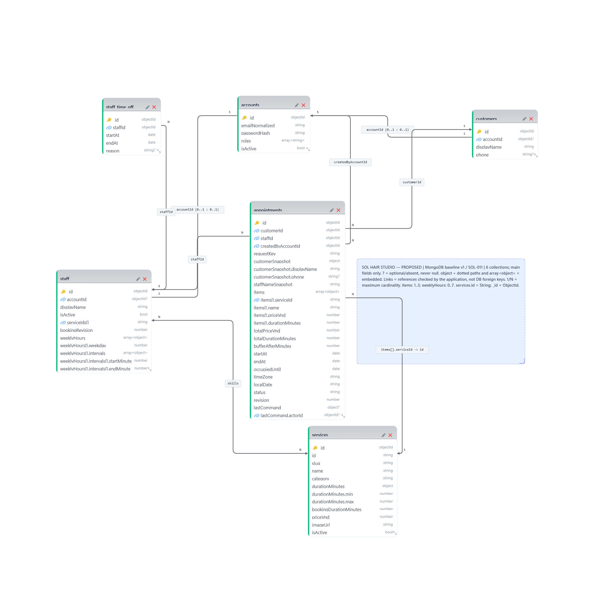

# SOL-011 — DB baseline v1

**PROPOSED — chờ NhanDuong21 duyệt.** Ngày lập: 29/09/2026. Đây là thiết kế, chưa được triển khai hoặc áp dụng lên MongoDB.

## Đọc từ đây



1. Xem sơ đồ; đường nối là reference do ứng dụng kiểm tra, **không phải foreign key của MongoDB**.
2. Đọc [luồng truy cập](queries-and-indexes.md#workload) trước [schema](schema.md).
3. Đi qua [quy tắc đặt lịch và chống trùng](business-rules.md), rồi [bộ mẫu giả](examples/README.md).
4. Xem [kế hoạch chuyển đổi](migration-plan.md) và duyệt [bảng quyết định](review.md#quyet-dinh).

## Nguồn và mức độ chắc chắn

| Loại | Nội dung |
| --- | --- |
| Hiện trạng có bằng chứng | Phân tích commit `e742630382df97d44e74321d8af82a52e506450f` trên `origin/main`; PR [#10](https://github.com/NhanDuong21/sol-hair-studio/pull/10) MERGED lúc `2026-09-29T00:42:01Z`. Model duy nhất của miền sản phẩm hiện có là services. |
| Yêu cầu chủ task đã chốt | SOL-011 chỉ làm tài liệu/sơ đồ/mẫu/check offline và Draft PR; giữ API danh mục; không đọc DB, không sửa runtime; baseline phải được chủ task duyệt. |
| Đề xuất chờ duyệt | Toàn bộ tài khoản, hồ sơ, nhân sự, lịch làm/nghỉ, lịch hẹn và các giới hạn số lượng dưới đây. Sheet PHẠM VI còn ghi quy tắc đặt lịch/vai trò/chi nhánh chưa chốt. |

Nguồn nội bộ: [Sheet chính](https://docs.google.com/spreadsheets/d/1mKBFo0c1PcSJEVwbI80AAsorL47a7VyGk-nE0hIGLbw/edit), [phạm vi môn học](../course-scope.md), [kiến trúc](../kien-truc-va-luong-chay.md), [model](../../apps/api/src/modules/services/services.model.js), [repository](../../apps/api/src/modules/services/services.repository.js), [controller](../../apps/api/src/modules/services/services.controller.js), [tests](../../apps/api/src/modules/services/tests/), [seed chỉ đọc](../../apps/api/scripts/seed-services.js).

Phiên bản từ package/lockfile: Node chạy `24.15.0`, npm `11.12.1`, Express `5.2.1`, Mongoose `9.10.1`, driver MongoDB `7.6.0`, Vite `8.3.0`, Expo `57.0.23`, React Native `0.86.3`. MongoDB Server/FCV/topology thực tế **chưa kiểm chứng**. Thiết kế nhắm MongoDB **8.0 với replica set hỗ trợ transaction**; đây là đề xuất môi trường, không nâng cấp gì trong task.

## Phạm vi bản nháp

Một tiệm, timezone `Asia/Ho_Chi_Minh`; một stylist/lịch; 1–3 dịch vụ nối tiếp; khách có tài khoản tự đặt hoặc lễ tân đặt hộ khách vãng lai. Không giữ chỗ tạm. Xác nhận đặt lịch ngay khi transaction commit. Giá và thời lượng lấy từ server, lưu snapshot trong lịch.

| Collection | Vì sao cần | Trạng thái |
| --- | --- | --- |
| `services` | Danh mục dùng chung; giữ public id String và DTO | Đã có; đề xuất bổ sung thời lượng đặt lịch |
| `accounts` | Danh tính đăng nhập/quyền; tách dữ liệu nhạy cảm khỏi hồ sơ | Đề xuất |
| `customers` | Hồ sơ khách, liên kết tài khoản tùy chọn; truy vấn lịch của khách | Đề xuất |
| `staff ` | Năng lực dịch vụ, ca lặp lại; document tranh chấp khi đặt lịch | Đề xuất |
| `staff_time_off` | Nghỉ ngoại lệ theo khoảng thời gian; tăng theo thời gian nên không nhúng vào staff | Đề xuất |
| `appointments` | Lịch hẹn, khoảng được giữ, snapshot và trạng thái | Đề xuất |

Không tách category vì hiện chỉ là nhãn hiển thị; không có CRUD/phân cấp category. Đánh giá chưa có yêu cầu đã duyệt nên hoãn; không tạo collection `reviews`. Không thiết kế thanh toán online, giữ chỗ TTL, điểm thưởng, kho, payroll, nhiều chi nhánh hoặc hạ tầng phân tán.

## Kiểm tra và điểm dừng

```powershell
node docs/database/checks/validate-examples.mjs
```

Script chỉ đọc bộ tài liệu/mẫu, dùng Node built-in. Kết quả không chứng minh validator/index/transaction thực tế hoạt động. [review.md](review.md) tách kiểm tra đã chạy, phân tích tình huống và các phần chưa kiểm chứng. Sau Draft PR, dừng ở PROPOSED; không triển khai model/API/migration trước khi duyệt.
